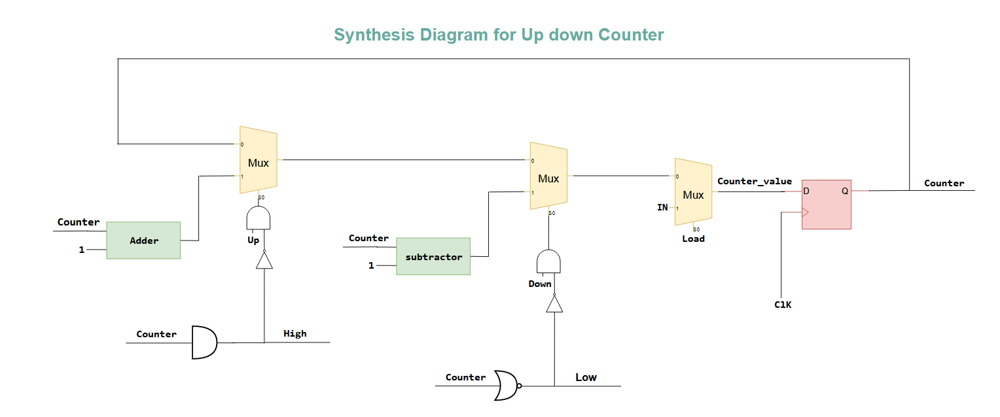
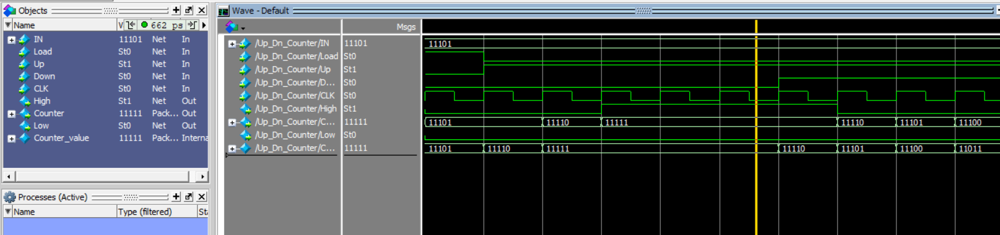

# 5 bits Up down counter using Verilog code 

### Specification

- 5-bit counter
- Count Value loaded from "IN" port on a positive clock edge when "Load" signal is high, Load has highest priority
- Count value incremented by 1 on a positive clock edgewhen "Up" signal is high.
- Count value decremented by 1 on a positive clock edge, when "Down" signal is high. Down has higher priority than "Up" signal.
- Increment stops at 31
- Decrement stops at 0
- "High" flag active high whenever count value is 31
- "Low" flag active high whenever count value is 0

### The synthesis diagram

---

### Final Simulation Results

